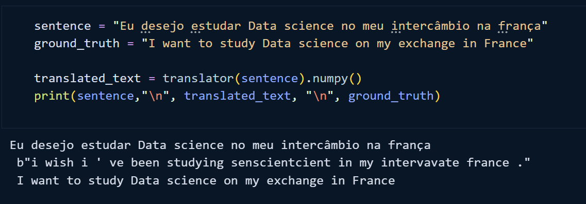
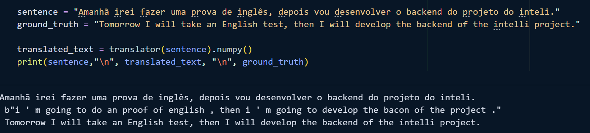
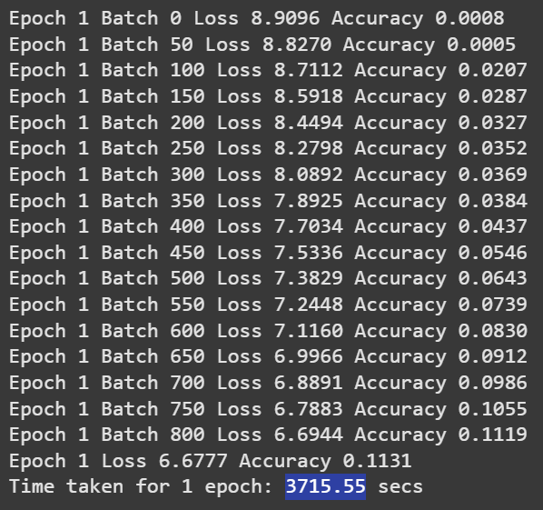

# Ponderada semana 2  Tradução usando Transformer

# Introdução
Transformer no contexto de NLP é um tipo de arquitetura de deep learning e diferentemente de redes neurais não depende de conexões sequenciais para realizar a tradução, além disso eles podem ser capazes de identificar relações de longa distância em um texto(a captura de relações de longa no exemplo não ficou tão boa, acredito ser pelo fato de que foram poucas épocas para o treinamento). Além disso, uma dos principais conceitos que diferenciam o transformer de outras arquiteturas é a "self-attention", que permite o transformer transmitir a informação através da sequência de input.

A ideia de transformer foi proposto em um paper(["Attention is all you need"](https://arxiv.org/abs/1706.03762) by Vaswani et al. (2017).) que foi super bem reconhecido, devido ao fato de ele ser capaz de transmitir informação entre a rede sem a necessidade de sequencialidade como uma RNN faz, os modelos de transformers podem ser executados de forma paralela.

# Pontos positivos

Altamente paralelizável: utilizando o transformer poderíamos rodar no sherek2 e utilizar-se da paralelização para reduzir significativamente o tempo de treinamento e de inferência.

Capturar dependências entre palavras que estão distantes: diferente de outras maneiras tradicionais ele consegue ter uma melhor precisão para entender relações entre palavras que estão mais distantes. Infelizmente no modelo "pond" ele apresenta uma dificuldade maior para entender essas relações, isso deve-se muito provavelmente ao fato de que foram realizadas apenas 10 épocas de treinamento.

Realiza a inferência(tradução) de forma rápida, apesar da tradução não ser sempre precisa(isso será detalhado na seção de pontos negativos)

# Pontos negativos

Requer alto poder computacional: por ser um modelo grande e complexo o transformer necessita de um alto poder computacional para ser treinado. Isso está diretamente ligado a demora no treinamento, onde usando GPU para treinar apenas 10 épocas foram 18 minutos.

Imprecisão: como foi observado nos testes, o modelo muitas vezes é impreciso durante a tradução e não consegue capturar tão bem a relação entre palavras mais distantes. Tal falta de precisão poderia ser melhorada com um dataset maior e com mais épocas de treinamento, fazendo com que o modelo fosse capaz de identificar melhor a relação entre as palavras.
Exemplo: 

Erro quando identifica palavras em inglês sendo utilizadas na frase original: em caso quando utilizamos palavras como backend, frontend, sprint, etc o modelo comete erros ao tentar traduzir aquela palavra.
Exemplo: 

# GPU X CPU

## GPU
Primeiramente, o modelo foi rodado no google colab utilizando uma T4, onde com 10 épocas de treinamento o modelo levou cerca de 18 minutos para realizar o treinamento. 

## CPU
Após a execução com GPU foi realizado o treinamento utilizando a CPU do google colab, porém nesse caso o tempo de treinamento foi extremamente maior, onde para executar apenas 1 época e metade de outra época de treinamento levou 1 hora e 26 minutos. Levando 61 minutos para executar apenas 1 época.

## Conclusão
Tendo em vista a diferença de tempo de treinamento entre CPU e GPU, o uso da segunda é altamente recomendado e significativamente superior. Além disso, o uso de paralelismo pode reduzir ainda mais o tempo de treinamento, tendo em vista que diferentemente de outras abordagens como RNN o uso de transformers permite a paralelização.